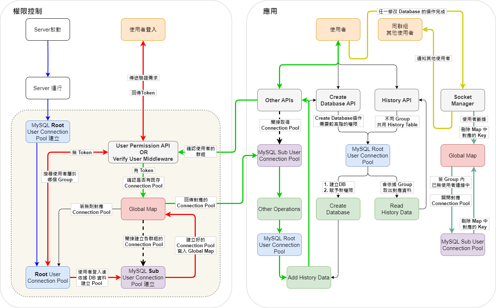

# MySQL Speaker 後端架構說明

## 目錄

- [後端架構圖](#後端架構圖)
- [技術設計說明](#技術設計說明)
  - [設計難點](#設計難點)
  - [系統啟動](#系統啟動)
  - [使用者登入](#使用者登入)
  - [Root User 相關操作](#root-user-相關操作)
  - [Sub User 相關操作](#sub-user-相關操作)
  - [即時通知](#即時通知)
  - [連線中斷](#連線中斷)
- [Back to README](#back-to-readme)

## 後端架構圖

- 這是我的後端架構圖，下面的段落會針對不同功能區塊說明

  

## 技術設計說明

### 設計難點

- 如何 **間接生成 Sub User Connection Pool** 以達到權限控制，並在之後的其他操作能 **撈取到對應的 Connection Pool**

  

### 系統啟動

- 系統啟動後，隨即會生成 Root User 的 Connection Pool

  

### 使用者登入

- 這部分是從 User Permission API **間接建立 Sub User Connection Pool** 的部分。
- 使用者進入網頁後。

  1. 檢查有沒有帶 Token。
  2. 使用帳號密碼從 User Permission API 登入。
  3. 透過 Root User 權限確認 Group 身分。
  4. 建立 Group User Connection Pool，並將資料加入 Global Map 中等待映射。
  5. 回傳 Token。

  

### Root User 相關操作

- Create Database 與 Read History 會需要較高的權限，所以會使用 Root User 來操作 Database。
- 若有任何修改 Data 的操作，會額外執行 將操作資訊加入 History Table 的步驟。

  - 避免同步前端歷史資訊時拿到錯誤資料，History Table 修改完成後才 return Response。

  

### Sub User 相關操作

- 這部分是 **間接取得 Sub User Connection Pool** 的部分。
- 除了前段兩個操作之外，都是使用 Group 的身分操作。

  1. 利用 token 辨識使用者身分。
  2. 透過 Verify User 的 Middleware 撈取對應的 Group User Connection Pool。
  3. 使用 Group User Connection Pool 接續操作。

- 同上一段 (Root User 相關操作)，若有任何修改 Data 的操作，會額外執行 將操作資訊加入 History Table 的步驟。
  - 修改 History Table 仍需透過 Root User 權限。
  - 避免同步前端歷史資訊時拿到錯誤資料，History Table 修改完成後才 return Response。

### 即時通知

- 利用 Socket.IO 同步操作情報給其他使用者
  1. 使用者有任何修改 Database 的操作，會在歷史資訊添加完成後，才會 return Response 給使用者。
  2. 執行操作的使用者會在收到 Response 後，發送消息給後端的 Socket Manager。
  3. Socket Manager 會通知其他用戶端有新的資訊請來更新。

### 連線中斷

- 使用者連線中斷。
  1. Socket Manager 會將使用者從 Global Map 上移除。
- 同群組的所有人都中斷了，就是群組內目前沒人在線上。
  1. 則會將該群組對應的 Connection Pool 關閉。
  2. 並將 Global Map 的對應資料也一併刪除。

## Back to README

- [Goto README.md](README.md)
